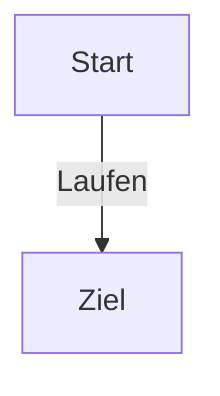

## Markdown-based-Note-Taking
- Talk title: Markdown based note taking apps
- Presenter: Lukas Jelonek
- Date: 23 November 2022
- Notes by: Christian Krippes, Johannes Keyser

## Idea
- The Idea: Take notes only in Markdown
- Simple file format, no dependency on specific software. 
- Avoid proprietary cloud providers if possible.

### Obsidian:

- [Obsidians] key feature is to connect notes with each other by tags
- Those tags are then used to produce a graph representation of your notes
- Community plugins for customization
- Sync between devices costs you and runs on Obsidians Cloud. 
  Cloud can be a downside for some people.


### Joplin

- [Joplin] is an open source software
- Brings similar look and feature set as Obsidian but with the possibility
to use well known solutions for data syncronization (e.g. Nextcloud, WebDAV and more)
- No proprietary cloud needed. Setup your own syncronization between your devices
- No graph representation of your notes
- Web-Clipper: Save Websites as notes
- Plugins are available


### Dendron
- [Dendron] is an open source software
- Plugin for VSCode, not standalone.
- Lots of similarities with Joplin and Obsidian
- Graph representation of your notes is possible
- Focus more on the way developers work


### Mention from the audience
 - [zettlr] was a recommendation from the audiance. 
 Its focus is more on users who write lager texts.

[Obsidians]:https://obsidian.md/
[Joplin]:https://joplinapp.org/
[Dendron]:https://www.dendron.so/
[zettlr]:https://www.zettlr.com/


### Mermaid
- [Mermaid] creates graphs out of markdown-like text
- Mermaid becomes handy when you already use markdown and want to quickly
visualize your ideas without having to use graphics software.


The syntax for the above diagram looks like this:


```
```mermaid
graph TD
    A[Start] -->|Laufen| B[Ziel]```
```

[Mermaid]:https://mermaid-js.github.io/mermaid/#/


## Visualization of Relational Data

- Talk title: Visualization of Relational Data
- Presenter: Marc Strickert
- Date: 23 November 2022
- Notes by: Christian Krippes, Marc Strickert
- License: CC0 1.0 Universal, see https://creativecommons.org/publicdomain/zero/1.0/

### What are relational data?

- entities whos relationships can be given in matrix form
- matrix examples: pairwise physical feature distances - the lower the more similar;
   score data ("similarities") - the larger the more similar
- good to know: a matrix of distances between n-dimensional vectors can be perfectly
   reconstructed as n-dimensional point cloud up to rotation, translation, scaling
- preferences are one example: I prefer apple over oranges;
   there is no common physical coordinate origin such as 0 meter length
- matrix data might be incomplete: if relation E to B is unknown, but E to A is,
   and B to C is, as well as and C to A is known, then E to B might be recovered
- scoring data my be asymmetric: Eve likes Paul, but Paul dislikes Eve (a bit)

### Visualization of relational data

- goal: intuitive visual inspection of abstract data tables / matrices
- for example, "embedding" distance data into Euclidean space (on sheet of paper,
   computer screen) to get point clouds
- distance preservation: pairwise matrix distances to be preserved in point clouds.
   Such distance preservation is called (metric) "multidimensional scaling".
   Usually symmetric inputs, i.e. dist(A,B) = dist(B,A)
- neighborhood preservation: for example entity B as third nearest neighbor
   to A in the scoring matrix to be reconstructed as point B being third
   nearest neighbor in corresponding scatter point representation (if possible).
   Neighborhood preservation can be called neighbor embedding. Famous approaches
   are "Kruskal scaling" and t-distributed neighbor embedding (t-SNE).

### Presented method: correlation based multidimensional scaling
- scatter plot coordinates X depend on distance matrix depend on
   maximization goal of correlation r between each row in the source
   scoring matrix S and the negative distance D matrix of point scatter
   coordinates, e.g.
- r(-D(X),S) to be maximized for each row in -D(X) leading to a
   possibly sub-optimal point cloud configuration

### Nerdy technical remarks regarding optimization

- for N points in k dimensions this leads to non-linear optimization
   for (N x k) free parameters for the scatter point positions
- to be optimized by the Broyden-Fletcher-Goldfarb-Shanno (BFGS) algorithm
   for continuous steepest descend problems
- using partial nested derivatives of correlation r wrt point coordinates X
- if correlation is non-linear (i.e. NOT the common Pearson correlation),
   such as Spearman or Kendall correlation, discrete steps in the optimization
   function are smoothened out by soft approximations of the ranking function

### Sources
- Code for MATLAB and GNU-Octave: <https://mloss.org/software/view/438/>
- Publication: <https://www.sciencedirect.com/science/article/pii/S0925231214003956>


## "License me if you can... or if you are allowed to" 

- Talk title: "License me if you can... or if you are allowed to"
- Presenter: Andre Pietsch
- Date: 23 November 2022
- Notes by: Andre Pietsch

### Ownership
- concept of ownership in Germany only applies to material objects
- from a legal perspective, data is not owned by someone
- medium, where the data is actually saved on, is owned by someone

### Authorship ≠ Copyright 
- authorship = state of being an author of a work or data
  - can not be transferred to others
- copyright = right by law to be the entity which determines who may publish, copy and distribute a piece of writing, music, picture or other work of authorship
  - can be transferred to others
- Neither is the copyright necessarily maintained by the author of a work nor does every piece of data fall under the copyright law
  - If you for example work on something and you get paid for it, then you are probably the author of it, but the copyright could lie at your employer.
- for scientific discourse: Always cite, which data you have used, even if it is published under a Public Domain license where attributing is not needed!

### The German Act on Copyright and Related Rights (UrhG)
- copyright protects the form of a work and not the content
  - works within the meaning of the Copyright Act are “only the author’s own intellectual creations” (Div. 2 Sec. 2 No. 2 UrhG)
  - protected is the creative performance of arranging the content in exactly this or that way
- therefore: copyright most often can not be applied to raw data or quantiative data
- Related Rights are rights that protect objects that are not directly subject to copyright.
  - database producer right: Protects a database if a substantial qualitative or quantitative investment was made to create this database.
- copyfraud = unlawful claim to copyright

### Copyright licenses
#### General licenses
- Creative Commons
  - Publish as open as possible and as closed as necessary!
  - Preferably use a CC0 or CC BY license!
- Open Data Commons
  - Were inteded as an equivalent alternative to Creative Commons, but have not caught on.
  - Suggestion: Just use CC licenses!
- Don't use CC licenses for software!

#### Software licenses
- Four types:
  - Strong Copyleft (GNU-GPL, GNU-AGPL)
    - CC equivalent = CC BY-SA
  - Weak Copyleft (LGPL, MPL, EPL)
    - used mainly for software libraries
  - Permissive (3-clause BSD, Apache, MIT)
    - CC equivalent: CC BY
  - Noncommercial (JRL, AFPL)
    - CC equivalent: CC BY-NC
- Special case: ethical licenses ("The Hippocratic License")
